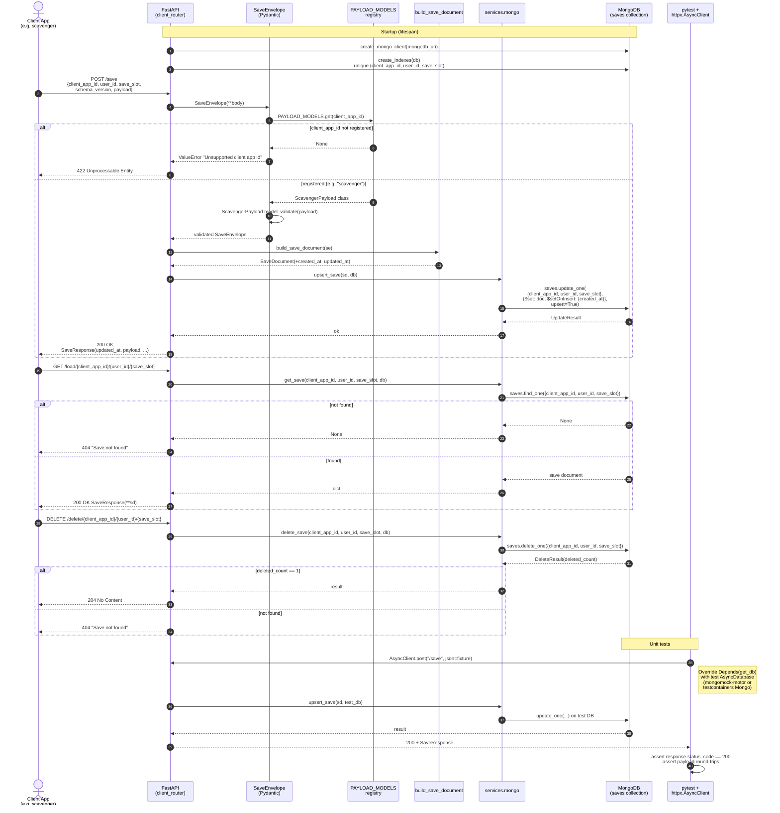

# microsave

## Project Structure

```
microsave/
├── app/
│   ├── main.py       # app factory, lifespan, exception handlers
│   ├── api/          # endpoints
│   ├── services/     # Ochestration
│   ├── models/       # request/response models
│   └── core/         # Settings via env / .env file, app logics
├── tests/
├── pyproject.toml
└── .env
```

## How to Request Data
This microsave service utilizes RESTful API. To request data operations (saving, loading, or deleting), execute HTTP requests to the target endpoints.

Available Endpoints:
``` 
Save State: POST /save
Requires a JSON body containing: client_app_id, user_id, save_slot, schema_version, and the actual payload data.

Load State: GET /load/{client_app_id}/{user_id}/{save_slot}
Retrieves a previously saved state based on the provided URL path parameters.

Delete State: DELETE /delete/{client_app_id}/{user_id}/{save_slot}
Removes a specific save slot for a given user.
```

Example Calls:
``` python
import requests

BASE_URL = "http://127.0.0.1:8000"

# Example: Requesting to SAVE data
save_payload = {
    "client_app_id": "scavenger",
    "user_id": "user_123",
    "save_slot": "slot 1",
    "schema_version": 1,
    "payload": {
        "data": "level_4_complete",
        "health": 85
    }
}
requests.post(f"{BASE_URL}/save", json=save_payload)

# Example: Requesting to LOAD data
requests.get(f"{BASE_URL}/load/scavenger/user_123/slot 1")
```

## How to Receive Data
This microservice synchronously responds to requests using standard HTTP status codes and JSON payloads. Successful HTTP status codes are: 200 OK for loads and saves, 204 No Content for deletes. If the requested save does not exist, the service will return a 404 Not Found status.

Example Receive and Process:
``` python
import requests

BASE_URL = "http://127.0.0.1:8000"

# 1. Execute the load request
response = requests.get(f"{BASE_URL}/load/scavenger/user_123/slot 1")

# 2. Receive and process the data based on status code
if response.status_code == 200:
    save_data = response.json()
    
    # Extract the custom payload
    custom_data = save_data.get("payload", {})
    last_updated = save_data.get("updated_at")
    
    print(f"Successfully loaded! Last saved at: {last_updated}")
    print(f"Game State: {custom_data}")

elif response.status_code == 404:
    print("No save file found in this slot.")
    
else:
    print(f"An error occurred: {response.status_code} - {response.text}")
```


## Public API

## UML Diagram


## MongoDB

### Write Cache

Implements a coalescing write-buffer (`io.BufferedWrite` / `collections.deque`):
- Every publish call stores only the most recent `(x, y)` per player in a dict; intermediate ticks are discarded.
- A background asyncio.Task flushes the buffer to MongoDB every 3 seconds.
- If a client's `POSITION_CACHE_MAX_PENDING` count is hit, the bufffer force-flushes that client immediately as a safety net.
- On shutdown, call `flush_all()` to drain the buffer before the connection is closed.
- If a flush fails, the entry is re-buffered so the next cycle can try again.

The free tier allows up to 100 operations per second. That's shared across all reads and writes hitting the cluster. With 5 clients polling at `20 fps tick rate = 100 writes/sec`, we're sitting right at the ceiling before a single read happens. With the 3-second write cache, that drops to roughly `5 clients ÷ 3 seconds = ~2 writes/sec`, plus poll calls. At 5 clients polling a few times a second, we're looking at maybe 15–20 ops/sec total, well within budget.


### Development Environment
Create and populate `.env.mongodb` environment file in the local project root. The environment file requires the following variables to be defined:

```
MONGODB_URI=<Replace with MongoDB Connection String>
MONGODB_DB_NAME=<Replace with Database Name>
```

> [!CAUTION]
> Do not commit `.env.mongodb` to git

## Git Workflow

#### Sync main before branching
1. `git checkout main`
2. `git pull --rebase origin main`

#### Create branch
1. `git checkout -b feature/task`

#### Write Code/Commit locally
1. `git add .`
2. `git commit -m "message"`

#### To squash a small commit into a bigger one
1. `git rebase -i HEAD~n`

#### Update branch before pushing
1. `git fetch origin` (or git pull)
2. `git rebase origin/main`

#### Push for PR
1. `git push -u origin feature/task`

